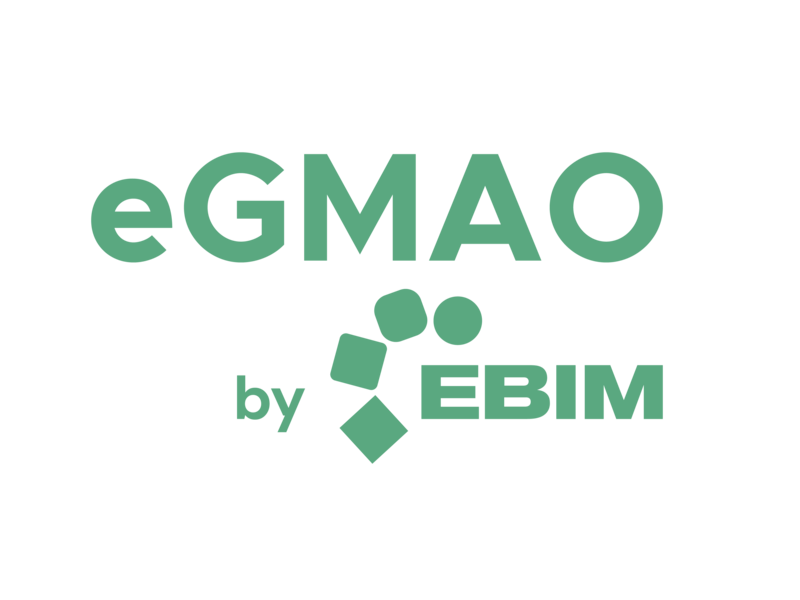

# Sistema de Gestión de Mantenimiento Industrial

[](https://flutter.dev/)
[](https://dart.dev/)
[]()

Aplicación multiplataforma desarrollada con Flutter para la gestión integral de mantenimiento de equipos industriales. Proyecto implementado como Demo de GMO por Gianpierre Mio para Ebim. Permite gestionar equipos, planificar mantenimientos, administrar órdenes de trabajo y monitorear avisos de fallos.

<div align="center">
  
</div>

## 📋 Características

- **Autenticación de Usuarios**: Sistema de login seguro con persistencia de sesión y manejo de roles
- **Gestión de Equipos**: Administración de clases, ubicaciones técnicas, puestos de trabajo y fichas técnicas
- **Planificación de Mantenimiento**: Creación de estrategias, hojas de ruta y ciclos de mantenimiento
- **Mantenimiento Correctivo**: Gestión de avisos de fallos, órdenes de trabajo y registros de intervenciones
- **Multiplataforma**: Acceso desde cualquier dispositivo (Web, Android, iOS, Windows, macOS, Linux)

## 🚀 Instalación

### Requisitos previos

- Flutter SDK 3.24.3 o superior
- Dart SDK 3.0.0 o superior
- Conexión a Internet para descarga de dependencias

### Pasos de instalación

1. Clona este repositorio:
   ```bash
   git clone https://github.com/GianMorales/sistema-gestion-mantenimiento.git
   cd sistema-gestion-mantenimiento
   ```

2. Instala las dependencias:
   ```bash
   flutter pub get
   ```

3. Configura las variables de entorno (opcional):
   - Crea un archivo `.env` en la raíz del proyecto
   ```
   # Ejemplo de configuración en .env
   API_URL=http://tu-servidor-api.com/api
   API_KEY=tu_api_key_aqui
   ```

4. Ejecuta la aplicación:
   ```bash
   flutter run -d chrome    # Para web
   flutter run -d windows   # Para Windows
   flutter run -d android   # Para Android
   flutter run              # Para dispositivo predeterminado
   ```

## ⚙️ Configuración

### Almacenamiento local

El proyecto utiliza diferentes mecanismos para gestionar los datos:

| Mecanismo | Descripción | Uso en la aplicación |
|-----------|-------------|----------------------|
| `SharedPreferences` | Almacenamiento clave-valor | Datos de autenticación y preferencias |
| `JSON` | Archivos de datos estructurados | Catálogos y datos maestros |
| `SQLite` | Base de datos local (futuro) | Almacenamiento de operaciones sin conexión |

### Datos de prueba

Los datos de prueba se incluyen como archivos JSON en la carpeta `assets/data/`:

- `users.json`: Usuarios para autenticación
- `class.json`: Catálogo de clases de equipos
- `equipament.json`: Catálogo de equipos
- `job.json`: Catálogo de puestos de trabajo
- `locations.json`: Catálogo de ubicaciones
- `ordenes.json`: Órdenes de trabajo
- `avisos.json`: Avisos de mantenimiento

## 🏗️ Arquitectura

El proyecto sigue una arquitectura modular:

```
lib/
├── main.dart         # Punto de entrada de la aplicación
├── src/
│   ├── app.dart      # Gestión del estado de autenticación
│   ├── pages/        # Pantallas de la aplicación
│   │   ├── auth/     # Autenticación
│   │   ├── home/     # Pantalla principal
│   │   ├── team/     # Gestión de equipos
│   │   ├── planning/ # Planificación
│   │   └── maintenance/ # Mantenimiento correctivo
│   ├── widgets/      # Componentes reutilizables
│   └── models/       # Modelos de datos
assets/
├── data/             # Archivos JSON con datos
└── images/           # Imágenes de la aplicación
```

### Patrones y frameworks utilizados:

- **StatefulWidget**: Para gestión de estado local
- **MaterialApp**: Implementación de Material Design
- **Navigator**: Sistema de navegación entre pantallas
- **SharedPreferences**: Persistencia de datos simple
- **JSON**: Serialización y deserialización de datos

## 🧪 Testing

Para ejecutar las pruebas del proyecto:

```bash
flutter test
```

## 📄 Licencia

Este proyecto está bajo la Licencia MIT. Desarrollado como demo para Ebim.

## 👥 Desarrollo

Proyecto desarrollado por Gianpierre Mio como parte de una demo para Ebim.

### Desarrollador Principal
- **Gianpierre Mio**: Desarrollador de software, encargado de implementar esta solución de gestión de mantenimiento industrial.

### Credenciales de Prueba

Para acceder al sistema:
- Usuario: `admin`
- Contraseña: `admin123`

### Para contribuir al proyecto:

1. Revisa las guías de estilo de código
2. Crea una rama para tu funcionalidad (`git checkout -b feature/nueva-funcionalidad`)
3. Haz commit de tus cambios (`git commit -m 'Agrega nueva funcionalidad'`)
4. Envía un Pull Request

## 📱 Características Técnicas

| Característica | Descripción | Implementación |
|----------------|-------------|----------------|
| **UI/UX** | Interfaz de usuario | Material Design con tema personalizado en naranja |
| **Navegación** | Gestión de rutas | Navigator 2.0 con transiciones personalizadas |
| **Persistencia** | Almacenamiento de datos | SharedPreferences para datos de sesión |
| **Autenticación** | Control de acceso | Sistema de login con validación de credenciales |
| **Offline** | Funcionamiento sin conexión | Almacenamiento local de datos esenciales |

## 📞 Contacto

Para soporte o consultas, contacta al desarrollador:

- **Nombre**: Gianpierre Mio
- **Email**: gianxs296@gmail.com
- **Teléfono**: +51952164832
- **Empresa**: Desarrollador para Ebim
